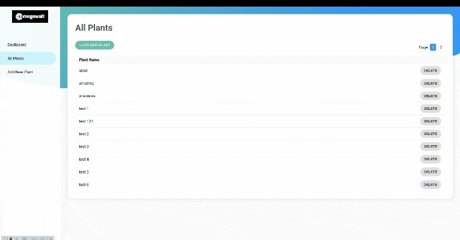

# 3Megawatt Code Challenge



This app is built for 3Megawatt as a code challenge for a Front-End job position.

## Structure
```
public/
 ├── assets/
 └── index.html
src/
 ├── __fixtures__/ ............... some fixtures to use in tests
 ├── __tests__/ .................. where the tests exist
 ├── components/ ................. the app building blocks
 │   └── ...
 ├── pages/ ...................... the pages to route to in the app
 │   ├── dashboard-page.tsx
 │   ├── new-plants-page.tsx
 │   └── plants-page.tsx
 ├── services/ ................... the gate for the backend services
 │   ├── DatapointsService.ts
 │   ├── new-plants-page.ts
 │   └── index.ts
 ├── theme/
 │   ├── breakpoints.js
 │   ├── colors.js
 │   ├── SharedComponents.tsx 
 │   └── index.ts
 ├── App.tsx ..................... The main component of the app
 ├── API.ts ...................... an instance of axios for accessing the backend
 ├── config.ts ................... global app configuration
 ├── index.tsx ................... App entry point
 ├── setupTests.ts ............... setting up the testing library 
 ├── types.ts .................... the types that are used in this app 
 └── utils.ts .................... shared utilities functions

```

## Technologies Used

### TypeScript
DescriptionTypeScript is an open-source programming language developed and maintained by Microsoft. It is a strict syntactical superset of JavaScript, and adds optional static typing to the language. TypeScript is designed for development of large applications and transcompiles to JavaScript.

### React
DescriptionReact is a JavaScript library for building user interfaces. It is maintained by Facebook and a community of individual developers and companies. React can be used as a base in the development of single-page or mobile applications

### Create React App
Create React App is an officially supported way to create single-page React applications. It offers a modern build setup with no configuration. It uses Webpack and Babel under the hood. 

### Axios
Axios is a promise based HTTP client for the browser and Node.js. Axios makes it easy to send asynchronous HTTP requests to REST endpoints and perform CRUD operations. It can be used in plain JavaScript or with a library such as Vue or React

### Emotion
Emotion is a performant and flexible CSS-in-JS library. Building on many other CSS-in-JS libraries, it allows you to style apps quickly with string or object styles. It has predictable composition to avoid specificity issues with CSS. With source maps and labels, Emotion has a great developer experience and great performance with heavy caching in production.

### Jest
Jest is a JavaScript testing framework designed to ensure correctness of any JavaScript codebase.


## Future work
- Add more tests.
- Use custom date picker library.
- Improve the accessibility.
- Use more animations.

## Development

### Front-End

This app is created with `create-react-app`. In the project directory, you can run:

#### `yarn start`

Runs the app in the development mode.<br />
Open [http://localhost:3000](http://localhost:3000) to view it in the browser.

The page will reload if you make edits.<br />
You will also see any lint errors in the console.

#### `yarn test`

Launches the test runner in the interactive watch mode.<br />
See the section about [running tests](https://facebook.github.io/create-react-app/docs/running-tests) for more information.

#### `yarn build`

Builds the app for production to the `build` folder.<br />
It correctly bundles React in production mode and optimizes the build for the best performance.

The build is minified and the filenames include the hashes.<br />
Your app is ready to be deployed!

See the section about [deployment](https://facebook.github.io/create-react-app/docs/deployment) for more information.

### Backend
It is provided as simple docker-composer file, you can download it and start it using `docker-compose up` from: https://gist.github.com/pablopalacios/9a00c7f835553c9d14267d2f442ad52d
then it will be start on `http://localhost:5001`.

## Credit
The credit goes for Haitham Alathamneh for building this Front-End part of the app, and for 3Megawatt for building this code challenge and providing the backend docker file.